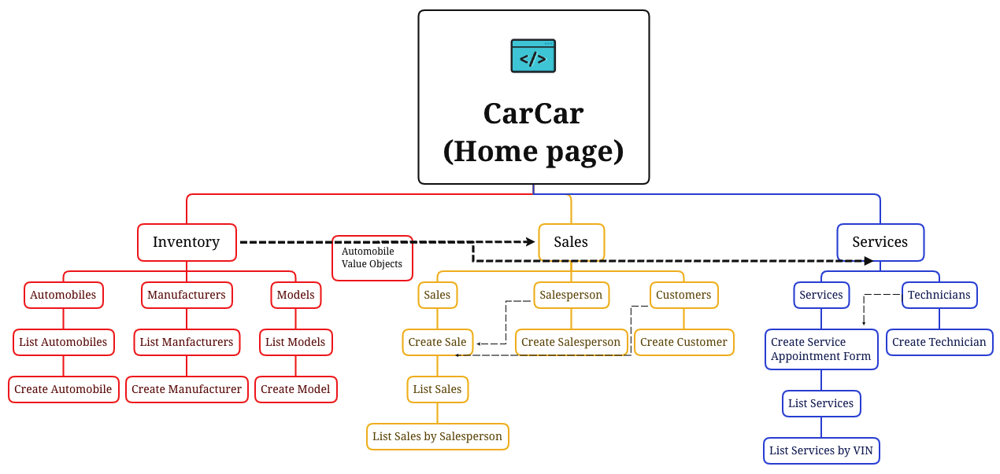

# CarCar

Team:

* Kamron Poosti - Sales
* Todd Compton - Services

## Design

CarCar is a web applllication designed to track a auto dealership by tracking inventory of vehicles, sales, and services. Each application is split into its own microservice, utilizing RESTful API's to provide each o ther with information. The project utilizes docker.
### CarCar Features:
* Create Auto Manufacturers & List Manufacturers
* Create Vehicle Models & List Models
* Create Vehicles & List Vehicles
* Create Salespersons
* Create Potential Customers
* Create a Sale & list all Sales
* A list of Salespersons sale record
* Create Technicians
* Create, List, Delete and complete Service Appointments
* Service Appointment List page with VIP feature for vehicles in the dealerships inventory
* Search for service history by VIN

### Context Map:


## Installation
1. Fork Repository from https://gitlab.com/ToddCompton/project-beta
2. Clone to your local machine with
```
git clone <insert HTTPS>
```
3. Input following commands into terminal:
```
 docker volume create beta-data
 docker-compose build
 docker-compose up
```
4. Access site via http://localhost:3000

### How to Use:
1. 
## Service microservice

Explain your models and integration with the inventory
microservice, here.

## Sales microservice

Explain your models and integration with the inventory
microservice, here.
